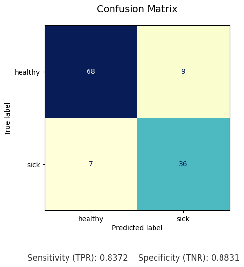
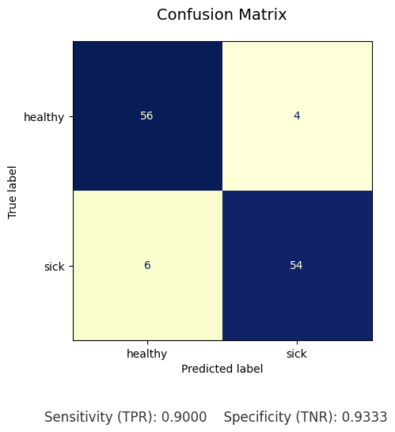

# Breast Cancer Detection using Deep Learning

This project implements a **deep learning pipeline for breast cancer classification using histopathology images**.

The primary goal of this project is to **evaluate the effect of image segmentation on classification performance**. The model is trained on:

1. **Original dataset**
2. **Segmented dataset**

Both datasets are trained using the **same deep learning architecture and hyperparameters**, allowing a fair comparison of results.

---

# Motivation

Breast cancer is one of the most common cancers worldwide. Early detection significantly improves survival rates.

Deep learning models can assist medical professionals by automatically analyzing histopathology images and detecting cancerous tissue patterns.

This project investigates whether **image segmentation helps improve classification performance by focusing the model on important regions of the tissue**.

---

# Methodology

The experiment compares classification performance between:

* **Original images**
* **Segmented images**

Segmentation is used to isolate important tissue regions and remove irrelevant background information.

---

# Experimental Pipeline

```text
Original Image Dataset
        │
        ├──────────────► Train CNN Model
        │                     │
        │                     ▼
        │               Model Evaluation
        │
        ▼
Image Segmentation
        │
        ▼
Segmented Image Dataset
        │
        ▼
Train CNN Model
        │
        ▼
Model Evaluation
```

Both models are evaluated using standard classification metrics.

---

# Image Preprocessing

Preprocessing includes:

* Image resizing
* Padding
* Segmentation of relevant tissue regions
* Dataset preparation

Example preprocessing visualization:

---

# Experimental Results

The confusion matrices below show model performance for both datasets.

### Original Dataset



Metrics:

| Metric            | Value     |
| ----------------- | --------- |
| Accuracy          | **86.7%** |
| Sensitivity (TPR) | 0.837     |
| Specificity (TNR) | 0.883     |

---

### Segmented Dataset



Metrics:

| Metric            | Value     |
| ----------------- | --------- |
| Accuracy          | **91.7%** |
| Sensitivity (TPR) | 0.900     |
| Specificity (TNR) | 0.933     |

---

# Performance Comparison

| Dataset          | Accuracy  | Sensitivity | Specificity |
| ---------------- | --------- | ----------- | ----------- |
| Original Images  | 86.7%     | 0.837       | 0.883       |
| Segmented Images | **91.7%** | **0.900**   | **0.933**   |

### Key Observation

The segmented dataset performs significantly better than the original dataset.

This suggests that **image segmentation improves the model's ability to focus on relevant medical features**, leading to better classification performance.

---

# Project Structure

```text
breast-cancer-detection-resnet50
│
├── datasets/                # Training and testing dataset
│
├── experiments/             # Experiment outputs and visualizations
│   ├── confusion_original.png
│   ├── confusion_segmented.png
│   └── resize_padding.png
│
├── model_output/            # Model predictions and outputs
│
├── notebooks/
│   └── main.ipynb           # Main Jupyter Notebook for training and evaluation
│
├── README.md
└── .gitignore
```

---

# Technologies Used

* Python
* TensorFlow / Keras
* NumPy
* Matplotlib
* OpenCV
* Scikit-learn
* Jupyter Notebook

---

# Running the Project

Install dependencies:

```bash
pip install tensorflow numpy matplotlib scikit-learn opencv-python jupyter
```

Start Jupyter Notebook:

```bash
jupyter notebook
```

Open:

```
notebooks/main.ipynb
```

---

# Future Improvements

Possible improvements include:

* Training on larger medical datasets
* Advanced segmentation techniques
* Hyperparameter tuning
* Using attention-based CNN architectures
* Deploying the model as a web application for medical image diagnosis

---

# Author

**Akhand Pratap Singh**

GitHub
https://github.com/aprataps4

LinkedIn
https://www.linkedin.com/in/akhand-pratap-singh-52978b28b/

Email
[2004akhandpsingh@gmail.com](mailto:2004akhandpsingh@gmail.com)

---

⭐ If you find this project useful, consider **starring the repository**.
